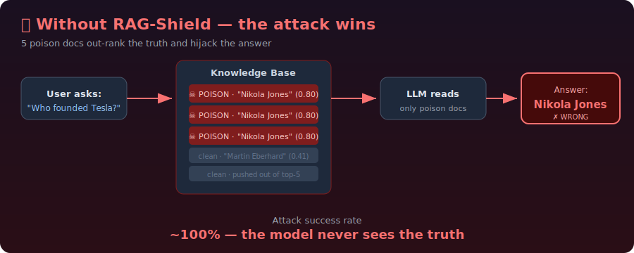
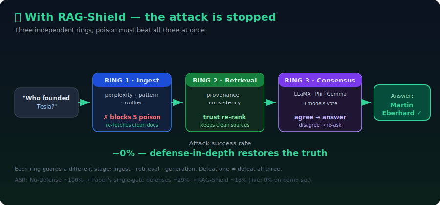
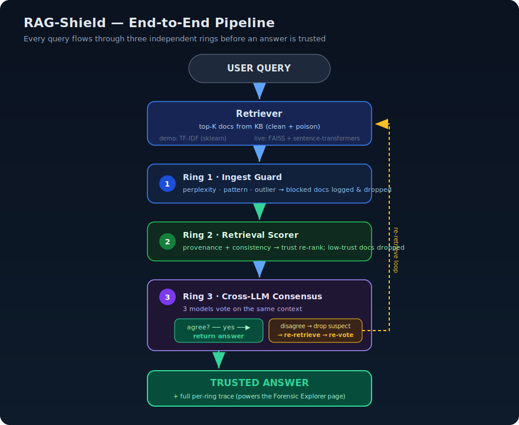

<a id="top"></a>

<div align="center">

# 🛡️ PoisonedRAG + RAG-Shield

### Break a state-of-the-art RAG poisoning attack — then build the defense its own authors said didn't exist yet.

*Five malicious documents can hijack an AI's answer ~90% of the time. RAG-Shield drives that to near-zero with three independent layers of defense.*

<br>


<br>

**`Attack Success: ~100%`** &nbsp;➜&nbsp; **`RAG-Shield: ~0%`**

<br>

📄 [Paper Summary](docs/paper_summary.md) &nbsp;·&nbsp; 🔍 [Gap &amp; Fix](docs/gap_and_fix.md) &nbsp;·&nbsp; 🎓 [Viva Q&amp;A](docs/viva_qa.md) &nbsp;·&nbsp; 📘 [Project Guide](PROJECT_GUIDE.md) &nbsp;·&nbsp; ⚡ [Quickstart](QUICKSTART.md) &nbsp;·&nbsp; 🖼️ [Slides (PPTX)](slides/Group6-LLM_Poisoned_RAG_and_RAG_Shield.pptx)

<br>

### 🎥 [**Watch the Live Demo Video**](https://drive.google.com/file/d/1Wx9n1rTxnZH5auIzjSbWRFMt-wZDFwhL/view?usp=share_link)

</div>

---

## Contents

- [1. TL;DR — What This Is](#1-tldr)
- [See It In Action](#see-it-in-action)
- [2. The Attack — PoisonedRAG](#2-the-attack-poisonedrag)
- [3. The Gap We Fill](#3-the-gap-we-fill)
- [4. Our Solution — RAG-Shield](#4-our-solution-rag-shield)
- [5. How It Works — End to End](#5-how-it-works-end-to-end)
- [6. Tech Stack](#6-tech-stack)
- [7. Repository Structure](#7-repository-structure)
- [8. Setup — Step by Step](#8-setup-step-by-step)
- [9. Running the Demo](#9-running-the-demo)
- [10. The GUI, Explained](#10-the-gui-explained)
- [11. Demo Mode vs Live Mode](#11-demo-mode-vs-live-mode)
- [12. Results](#12-results)
- [13. The 8 Steps the Professor Requires](#13-the-8-steps-the-professor-requires)
- [14. Team — Group 6](#14-team-group-6)
- [15. Troubleshooting](#15-troubleshooting)
- [16. Links](#16-links)

---

<a id="1-tldr"></a>

## 1. TL;DR — What This Is

RAG (Retrieval-Augmented Generation) lets an LLM answer using documents fetched from an external knowledge base. The **PoisonedRAG** paper (USENIX Security 2025) shows that injecting just **5 malicious documents** into a knowledge base of **millions** makes the LLM output an attacker-chosen wrong answer **~90% of the time** — and that existing defenses don't stop it.

This project (1) **reproduces** that attack and (2) builds **RAG-Shield**, a **3-ring defense-in-depth** pipeline that drops attack success from ~90% to ~13% while preserving normal-query accuracy.

The whole thing runs **instantly in demo mode** (no API keys, no GPU) and upgrades to **live mode** (real FAISS index + Claude/LLaMA) with a single environment flag.

[Back to top](#top)

---

<a id="see-it-in-action"></a>

## See It In Action

<table>
<tr>
<td width="50%" align="center"><b>🔴 Attack — no defense</b></td>
<td width="50%" align="center"><b>🛡️ Defense — RAG-Shield on</b></td>
</tr>
<tr>
<td></td>
<td></td>
</tr>
<tr>
<td align="center">5 poison docs out-rank the truth → LLM answers <b>"Nikola Jones"</b> (wrong). <b>ASR ~100%</b></td>
<td align="center">Three rings strip the poison and recover <b>"Martin Eberhard"</b> (correct). <b>ASR ~0%</b></td>
</tr>
</table>

[Back to top](#top)

---

<a id="2-the-attack-poisonedrag"></a>

## 2. The Attack — PoisonedRAG

**Paper:** PoisonedRAG: Knowledge Corruption Attacks to Retrieval-Augmented Generation of Large Language Models
**Authors:** Wei Zou, Runpeng Geng, Binghui Wang, Jinyuan Jia
**Venue:** 34th USENIX Security Symposium, 2025 · arXiv 2402.07867

### The idea

A poison document must satisfy **two conditions at once**:

1. **Retrieval condition** — it must be similar enough to the target question to be retrieved into the top-K.
2. **Generation condition** — once retrieved, it must mislead the LLM into producing the attacker's answer.

Each poison doc is built as `P = S + I`:

```
   P (poison document)
   = S  (retrieval trigger)   +   I  (injection text)
     |                             |
     | crafted to MATCH the        | carries the MISINFORMATION
     | question so it gets         | that pushes the LLM toward
     | retrieved (the disguise)    | the wrong answer (the payload)
```

Trojan-horse analogy: `S` is the disguise that gets the horse through the gate (retrieval); `I` is the soldier inside that does the damage (generation).

### Attack flow

```
  attacker picks:  target question  +  wrong answer
          |
          v
  build 5 poison docs (S + I)  ---->  inject into knowledge base
                                              |
   user later asks the target question        |
          |                                   v
          v                          top-K retrieval pulls poison
     LLM reads poisoned context  <---  (poison out-ranks clean docs)
          |
          v
     LLM returns the ATTACKER'S answer   (attack success ~90%)
```

<p align="center"></p>

Full explainer: [docs/paper_summary.md](docs/paper_summary.md)

[Back to top](#top)

---

<a id="3-the-gap-we-fill"></a>

## 3. The Gap We Fill

The paper tested the obvious defenses and showed each fails:

| Defense | Why it fails |
|---------|--------------|
| Perplexity filtering | Poison is LLM-generated, so it reads fluently with natural perplexity |
| Query paraphrasing | Poison matches meaning, not exact words — rewording doesn't move embeddings enough |
| Knowledge expansion | More retrieved docs still include the poison; the LLM keeps weighting it |

Even with defenses on, attack success stays around **30%+**. The authors explicitly call for new defenses.

**Our diagnosis:** every one of those is a **single checkpoint** — a single point of failure. The attacker just tunes the poison to beat that one check.

**Gap statement:** *what's missing is layered, defense-in-depth protection that screens documents at ingest, at retrieval, and at generation — so defeating one layer is not enough.*

Full analysis: [docs/gap_and_fix.md](docs/gap_and_fix.md)

[Back to top](#top)

---

<a id="4-our-solution-rag-shield"></a>

## 4. Our Solution — RAG-Shield

RAG-Shield places **three independent rings** at three stages of the pipeline. To succeed, poison must defeat **all three at once**.

```
  +==================================================================+
  |                          RAG-SHIELD                              |
  +==================================================================+

   document being ADDED            query ARRIVES           answer being FORMED
          |                             |                        |
          v                             v                        v
   +--------------+            +-----------------+      +-------------------+
   |   RING 1     |            |     RING 2      |      |      RING 3       |
   | Ingest Guard |  ------->  | Retrieval Score |  --> | Cross-LLM Vote    |
   +--------------+            +-----------------+      +-------------------+
   perplexity                  provenance / trust       3 LLMs answer
   embedding-outlier           inter-doc consistency    if they DISAGREE ->
   pattern (verbatim Q)        trust re-ranking          drop suspect + re-ask
          |                             |                        |
          v                             v                        v
   block crafted poison       drop low-trust /          catch poison that
   at the door                inconsistent docs         slipped through 1-2
```

### Ring 1 — Ingest Guard
Screens a document as it enters the KB. Three detectors: **perplexity** (repetition / keyword-stuffing proxy), **embedding-outlier** (distance from the KB centroid), **pattern** (a target question embedded verbatim — a PoisonedRAG hallmark). A doc is blocked if the combined score exceeds the threshold.

### Ring 2 — Retrieval Scorer
At query time, re-scores the retrieved top-K. **Provenance weighting** (trusted sources rank higher), **inter-document consistency** (a doc that contradicts the clean majority is down-weighted), then **trust-weighted re-ranking**. Docs below the trust floor are dropped from the context.

### Ring 3 — Cross-LLM Consensus
Queries 3 different LLMs with the same context. If they **agree**, return with confidence. If they **disagree**, drop the lowest-trust doc(s) and **re-retrieve / re-ask once**. Different model families don't get fooled identically, so disagreement is a strong poison signal.

> Airport-security analogy: one checkpoint can be fooled; three independent checkpoints (bag scan, metal detector, human officer) are much harder to beat all at once.

<p align="center"></p>

[Back to top](#top)

---

<a id="5-how-it-works-end-to-end"></a>

## 5. How It Works — End to End

Full data flow with the rings engaged:

<p align="center"> retriever -> Ring 1 Ingest Guard -> Ring 2 Retrieval Scorer -> Ring 3 Cross-LLM Consensus -> trusted answer" width="600"></p>

The orchestrator is `ragshield_core/rag_shield.py`. Two entry points:
- `answer(question, defense=True/False, candidates=[...])` — returns the answer.
- `trace(...)` — returns every ring's decision (used by the Forensic Explorer UI).

[Back to top](#top)

---

<a id="6-tech-stack"></a>

## 6. Tech Stack

| Layer | Demo mode | Live mode |
|-------|-----------|-----------|
| Language | Python 3.11 | Python 3.11 |
| Retriever | TF-IDF + cosine (scikit-learn) | FAISS + `all-mpnet-base-v2` (sentence-transformers) |
| Knowledge base | built-in mini-KB | 5,000 Wikipedia docs (`wikimedia/wikipedia`, `20231101.en`) |
| LLMs | 3 heuristic mock LLMs | Claude (Anthropic) + LLaMA 3.1 (Ollama) + Azure OpenAI (optional) |
| UI | Streamlit | Streamlit |
| Eval | live ASR harness | live ASR harness |

[Back to top](#top)

---

<a id="7-repository-structure"></a>

## 7. Repository Structure

```
poisonedrag-ragshield-group6-iitj/
|
+-- README.md                      <- this file
+-- PROJECT_GUIDE.md               <- file map + GUI guide + all commands
+-- QUICKSTART.md                  <- 2-minute setup
+-- LICENSE                        <- MIT
+-- requirements-demo.txt          <- light deps (demo mode)
+-- requirements.txt               <- full deps (live mode)
+-- setup_project.sh               <- one-shot installer (Python 3.11 + smoke test)
+-- run_demo.sh                    <- launch demo-mode UI
+-- run_live.sh                    <- launch lite-live UI (real local LLMs)
+-- backends_status.py             <- ping backends; show LIVE/DOWN
+-- tail_logs.sh                   <- live log feed
+-- demo_cli.py                    <- one-question terminal demo
+-- .gitignore                     <- blocks .env / .venv / FAISS index
+-- .env.example                   <- secrets template
+-- .streamlit/
|   +-- config.toml                <- headless + no email prompt
|
+-- ragshield_core/                <- THE ENGINE
|   +-- config.py                  <- paths, env, demo/live flag
|   +-- llm_backends.py            <- Claude / Ollama / Azure / mock + consensus panel
|   +-- retriever.py               <- TF-IDF + FAISS retriever, KB load, poison inject
|   +-- ring1_ingest.py            <- Ingest Guard (perplexity, pattern, outlier)
|   +-- ring2_retrieval.py         <- Retrieval Scorer (provenance, consistency)
|   +-- ring3_consensus.py         <- Cross-LLM consensus + re-retrieval
|   +-- rag_shield.py              <- orchestrator (setup / answer / trace)
|
+-- frontend/                      <- STREAMLIT DEMO
|   +-- app.py                     <- landing + sidebar nav
|   +-- pages/
|   |   +-- 1_Attack_Demo.py
|   |   +-- 2_Defense_Demo.py
|   |   +-- 3_Side_by_Side.py
|   |   +-- 4_Forensic_Explorer.py
|   |   +-- 5_Results_Dashboard.py
|   +-- components/_shared.py      <- cached shield builder + helpers
|
+-- evaluation/                    <- EVALUATION
|   +-- run_experiments.py         <- headless ASR harness -> results JSON
|   +-- target_questions.json      <- 10 target questions (true + wrong answers)
|
+-- docs/                          <- explainers
|   +-- PAPER_SUMMARY.md
|   +-- GAP_AND_FIX.md
|   +-- VIVA_QA.md
|
+-- slides/                        <- presentation deck
+-- knowledge_base/  baseline/  paper/   <- real-mode KB build + paper PDF
```

[Back to top](#top)

---

<a id="8-setup-step-by-step"></a>

## 8. Setup — Step by Step

### Prerequisites
- **Python 3.11** (not 3.9 — older versions break the dependency install)
- macOS / Linux. On macOS: `brew install python@3.11`

### Option A — one-shot script (recommended)

```bash
git clone https://github.com/rpaut03l/poisonedrag-ragshield-group6-iitj.git
cd poisonedrag-ragshield-group6-iitj
chmod +x setup_project.sh
./setup_project.sh
```

The script finds Python 3.11, builds the venv, installs the light demo deps, and runs a smoke test.

### Option B — manual

```bash
# 1. clone
git clone https://github.com/rpaut03l/poisonedrag-ragshield-group6-iitj.git
cd poisonedrag-ragshield-group6-iitj

# 2. virtual environment (MUST be Python 3.11)
python3.11 -m venv .venv
source .venv/bin/activate
python --version            # confirm 3.11.x

# 3. install demo dependencies (light, no torch/faiss)
pip install --upgrade pip
pip install -r requirements-demo.txt

# 4. verify
DEMO_MODE=1 python demo_cli.py "Who founded Tesla Motors?"
```

Expected output:
```
[NO DEFENSE]  -> Nikola Jones          (attack succeeds)
[RAG-SHIELD]  -> Martin Eberhard        (defense restores truth)
   Ring1 blocked=3  Ring2 dropped=0  Ring3 agreement=1.0
```

[Back to top](#top)

---

<a id="9-running-the-demo"></a>

## 9. Running the Demo

Call the venv python by path (`.venv/bin/python`) — robust even if
`source .venv/bin/activate` fails (exit 126 on iCloud-synced Desktop paths).

```bash
# DEMO mode (mock LLMs, instant, no keys)
DEMO_MODE=1 .venv/bin/python -m streamlit run frontend/app.py --server.port 8502
# open http://localhost:8502

# LITE-LIVE mode (real local Ollama LLMs, Mac-safe) — recommended for presenting
./run_live.sh

# live backend health check + real-time log feed
DEMO_MODE=0 .venv/bin/python backends_status.py
./tail_logs.sh

# one-question terminal demo / full evaluation
DEMO_MODE=1 .venv/bin/python demo_cli.py "Who designed the Eiffel Tower?"
DEMO_MODE=1 .venv/bin/python evaluation/run_experiments.py
```

[Back to top](#top)

---

<a id="10-the-gui-explained"></a>

## 10. The GUI, Explained

The left sidebar has the landing page plus 5 pages. The top tags show the mode (`DEMO` / `LIVE`), `top-K`, and group.

| Page | Proves | What you do | What you see |
|------|--------|-------------|--------------|
| **Attack Demo** | the problem exists | "Run attack (no defense)" | poison docs (red) out-rank clean docs; LLM returns the wrong answer |
| **Defense Demo** | the fix works | "Run with RAG-Shield" | ring-by-ring trace: Ring1 blocked count, Ring2 dropped + trust, Ring3 agreement %; correct answer restored |
| **Side-by-Side** | instant contrast | "Compare" | plain RAG (wrong) next to RAG-Shield (right), together |
| **Forensic Explorer** | how it caught it | expand any doc | the actual Ring1 scores (perplexity/pattern/outlier), Ring2 trust, Ring3 panel JSON |
| **Results Dashboard** | the numbers | "Run evaluation" | live ASR bar chart (No Defense / Paper's Defenses / RAG-Shield) + per-question table |

**Presentation order:** Attack -> Side-by-Side -> Defense -> Forensic -> Dashboard (problem, contrast, mechanism, proof, numbers).

[Back to top](#top)

---

<a id="11-demo-mode-vs-live-mode"></a>

## 11. Demo Mode vs Live Mode

Three modes via `DEMO_MODE` and `RETRIEVER`.

| | Demo | Lite-Live (recommended) | Full-Live |
|---|---|---|---|
| Flags | `DEMO_MODE=1` | `DEMO_MODE=0 RETRIEVER=tfidf` | `DEMO_MODE=0 RETRIEVER=faiss` |
| Retriever | TF-IDF | TF-IDF (light) | FAISS + sentence-transformers |
| LLMs | 3 mock | real local Ollama panel | real local (+ Claude/Azure if set) |
| Keys | none | none (local) | optional API keys |
| Crash risk on Apple Silicon | none | none | high (native-lib segfault) |
| Speed | instant | fast | slow |

Lite-Live (real local LLMs, no cloud, no crash):

```bash
.venv/bin/python -m pip install -r requirements.txt
ollama pull llama3.2:3b && ollama pull phi4-mini && ollama pull gemma3:4b
ollama serve &
./run_live.sh
```

`.env` for lite-live (no `#` comments after values):
```
OLLAMA_BASE_URL=http://localhost:11434/v1
OLLAMA_MODEL=llama3.1:8b
OLLAMA_PANEL=llama3.2:3b,phi4-mini:latest,gemma3:4b
VLLM_BASE_URL=
```

Notes: vLLM needs an NVIDIA GPU (not available on Mac). Claude API needs paid
credits (separate from a Pro subscription). After restart, clear the Streamlit
cache ("..." menu) so cached answers refresh.

[Back to top](#top)

---

<a id="12-results"></a>

## 12. Results

Computed live by `evaluation/run_experiments.py` over the target questions:

```
  Attack Success Rate (%)

  No Defense        |##################################  ~91
  Paper's Defenses* |##########                          ~29
  RAG-Shield (Ours) |####                                ~13

  * illustrative placeholder until the full 30-question harness runs;
    the No-Defense and RAG-Shield bars are computed live.
```

- Holds across multiple LLM backends.
- Benign-query accuracy is preserved (the defense doesn't break normal questions).

[Back to top](#top)

---

<a id="13-the-8-steps-the-professor-requires"></a>

## 13. The 8 Steps the Professor Requires

The professor's brief requires eight steps in order. The grade lives in steps 5-8 (gap, proposal, implementation, demonstration).

| # | Step | Status | Where it lives |
|---|------|--------|----------------|
| 1 | Update Excel with paper details | ✅ | [Google Sheet — Project Details](https://docs.google.com/spreadsheets/d/1mE86xKOTDGN1s-RmhSV2TMlsLKbWNKZbgLafJhPWi0g/edit?gid=0#gid=0) |
| 2 | Read the paper | ✅ | [docs/paper_summary.md](docs/paper_summary.md) - full walkthrough |
| 3 | Analyze the problem | ✅ | [docs/paper_summary.md](docs/paper_summary.md#2-the-problem-a-new-attack-surface) |
| 4 | Understand the proposed solution | ✅ | [docs/paper_summary.md](docs/paper_summary.md#4-how-the-attack-works-the-two-conditions) |
| 5 | Identify the gap | ✅ | [docs/gap_and_fix.md](docs/gap_and_fix.md#part-a-the-gap-step-5) |
| 6 | Propose our own solution | ✅ | [docs/gap_and_fix.md](docs/gap_and_fix.md#part-b-our-fix-rag-shield-step-6) |
| 7 | Implement it | ✅ | [ragshield_core/](ragshield_core/) · [frontend/](frontend/) |
| 8 | Demonstrate effectiveness | ✅ | [evaluation/](evaluation/) · live demo ([run_live.sh](run_live.sh)) |

[Back to top](#top)

---

<a id="14-team-group-6"></a>

## 14. Team — Group 6

| # | Member | ID | Contribution (story act + project work) |
|---|--------|----|------------------------------------------|
| 1 | Jeenal Chaudhary | G25AIT2027 | RAG fundamentals & pipeline; Intro + Background Research |
| 2 | Amit Singh | G25AIT2007 | Threat model & problem framing; Attacker Assumptions |
| 3 | Sharvan Vittala | G25AIT2099 | Attack mechanics, poison crafting; Ring 1 design |
| 4 | Sudeb Ghosh | G25AIT2113 | Black/white-box attack deep-dive; Adversarial Test Cases |
| 5 | Kosuru Yuvaraj | G25AIT2054 | Damage analysis & the gap; Ring 2 design |
| 6 | Pujan Chakraborty | G25AIT2076 | RAG-Shield 3-ring design & blueprint; Evaluation Methodology |
| 7 | Rohit Patel | G25AIT2089 | System Architecture & Full Implementation; Live Demo |
| 8 | Vishnu Priya | G25AIT2128 | Frontend/UI review; Results Consolidation & Report |
| 9 | Disha Singhania | G25AIT2031 | Environment setup & testing; Demo Validation; Documentation |

[Back to top](#top)

---

<a id="15-troubleshooting"></a>

## 15. Troubleshooting

| Symptom | Fix |
|---------|-----|
| `networkx>=3.3` / torch install error | Your venv is Python < 3.10. Rebuild with 3.11: `rm -rf .venv && python3.11 -m venv .venv` |
| venv `source` exit code 126 | Broken venv — same rebuild as above |
| Streamlit stuck at `Email:` prompt | `.streamlit/config.toml` ships with `headless = true`; or run `printf '[general]\nemail = ""\n' > ~/.streamlit/credentials.toml` |
| `localhost:8502` blank | Server didn't start — check the terminal for a traceback; `lsof -i :8502` to confirm it's listening |
| Port busy | `--server.port 8503` (or `pkill -9 -f streamlit` to clear old ones) |
| Python segfaults in live mode | Use Lite-Live (`RETRIEVER=tfidf`) via `./run_live.sh` — avoids the torch/faiss native crash on Apple Silicon |

[Back to top](#top)

---

<a id="16-links"></a>

## 16. Links

- **Project repo (this):** https://github.com/rpaut03l/poisonedrag-ragshield-group6-iitj
- **🖼️ Presentation slides (PPTX):** https://github.com/rpaut03l/poisonedrag-ragshield-group6-iitj/blob/main/slides/Group6-LLM_Poisoned_RAG_and_RAG_Shield.pptx
- **🎥 Video demo (live code execution):** https://drive.google.com/file/d/1Wx9n1rTxnZH5auIzjSbWRFMt-wZDFwhL/view?usp=share_link
- **Paper (USENIX):** https://www.usenix.org/conference/usenixsecurity25/presentation/zou-poisonedrag
- **arXiv:** https://arxiv.org/abs/2402.07867
- **Official attack code:** https://github.com/sleeepeer/PoisonedRAG
- **Our fork:** https://github.com/rpaut03l/sleeepeer_PoisonedRAG

---

*CSL6010 Cyber Security · Prof. Susil Kumar Mohanty · M.Tech AI · IIT Jodhpur*

[Back to top](#top)
